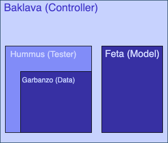

## TMAP Design Doc


This document serves the purpose of highlighting the goals of TMAP (name tentative) and the associated design decision proposal with regards to the implementation.

---

### Goals

TMAP is designed to be a framework that allows users to implement algorithms to solve the 
disease gene prioritization problem. For purposes of this document the problem is defined as the following: 

Given a graph G = (V,E) where $V \in R^{n\times d}$ and $E \in R^{n \times n \times e}$ alongside $D \subset V$ of known disease genes we aim to output $C = \{C_i | \forall d \in D, \{\forall v \in V, (v, \text{sim}(v, d)) \} \}$. For reference $n$ is the number of nodes in $G$ and $d$ and $e$ are the node and edge features respectively, sim is a similarity metric that measures how similar a particular gene is with respect to another disease gene. In simpler terms we want to output a set of genes similar to a disease gene for all disease genes.

At a high level we want a function like `prioritize` which we can call for all the disease genes:

```rust
fn prioritize(g : Graph, disease_gene: Gene) -> HashSet<(Gene, f64)> {
...
}
```

Given the aforementioned problem, a brief summary of the goals we want to achieve are the following: 

1. Provide a *robust* system to allow for users to rapidly prototype prioritization algorithms without worrying about data wrangling and processing.
2. Generate a reliable data processing pipeline such that if users want to run on custom graphs and genesets we provide both built-in parsing mechanisms and allow for custom parsing. 
3. Provide a testing suite that is flexible for both supervised and unsupervised algorithms.


### Technical Challenges

The two biggest technical challenge that I forsee in this project are:

1. Not every gene prioritization algorithm is the same, some require training, some require hyper-parameters and so exposing a uniform interface for interaction seems fairly challenging.
2. The coupling of logic as a means to save time. There will be times where it might be easier to come up with a hacky solution to wire together our data pipeline and our models, and this might eventually lead into some spaghetti code.

Additional technical challenges will be the following: 

1. Often times we will be asked to benchmark our method against other peoples' techniques, and unfortunately researchers are not well known to decouple their data and model pipelines. (We'll get to this nightmare when we have to). 
2. Our codebase will be consisting of two languages, both Rust and Python. The overhead of using two languages might be challenging, and there are many difficulties that arise from multi-language use, but I believe the benefits of Rust's strong type system are too good to give up and will force us to think a lot more w.r.t design.


---

### Proposed Design

The structure of TMAP is expected to be the following.



The general roles of the system are broken down into food names (as they are fun). 

#### How they interact (Briefly)

Before diving into the specifics of each piece its important to consider how each piece will interact with one another. A model will come with a description indicating what requirements need to be satisfied for execution. It is then up to the controller to parse the model description and adapt and tune the tester in order to assist the model for testing and potentially training. Furthermore any form of IO should be restricted to the controller.


#### Feta (Model)

This layer is probably going to be what everything revolves around. My theory for this is that Feta's needs implement a description for each model that should dictate a lot of the rest of the programs logic. e.g.

```python
@dataclasses.dataclass
class Description:
	requires_training: bool,
	training_opts: TrainingOptions, # Hummus should know about TrainingOptions
	hyper_params: Dict[str, Any],
	... # Potentially more if we need them
```

Which brings us to the minimum viable definition for a model:

```python
class Feta(ABC):
	@abstractproperty
	def description(self) -> Description:
		...
	@abstractmethod
	def prioritize(self, disease_gene: Gene, graph: Union[Graph, None]) -> Set[Tuple[Gene, float]]:
		# In theory a model need not store the Graph and thus should rely on the Data library to pass it.
		...
	def __call__(self, disease_gene, graph: Union[Graph, None]) -> Set[Tuple[Gene, float]]:
		return self.prioritize(disease_gene, graph)
```

An example of Feta can be the following:

```python
class RandomWalkWithRestart(Feta):

	def __init__(self, hyper_params):
		self._desc = Description(requires_training=False, training_opts=None, hyper_params=hyper_params)
	def description(self) -> Description:
		return self.__desc
	def prioritize(self, disease_gene: Gene, graph: Union[Graph, None]) -> Set[Tuple[Gene, float]]:
		# implement rwr
		...
```

Despite being very flexible, the above model may need to recompute properties about the graph repeatedly. Exposing a need for pre-computation. As such I additionally propose the following pre-computation subtype.

```python
class PreComputeFeta(Feta):
	@abstractmethod
	def setup(self, graph: Graph, *args, **kwargs):
		...
```

Prior to a call to `prioritize` this function ensures that a setup method is called as to make computation easier. I currently expect to only pass the input graph into this, but potentially in the future things may change (hence the other arguments).

The last consideration for now is trainable models. Although its not the models responsibility to find the data, it is its responsibility to handle the incoming data to train some set of parameters.

```python
class TrainableFeta(Feta):
	@abstracmethod
	def train(self, graph: Graph, disease_genes: Set[Gene], **kwargs):
		...
```


#### Garbanzo (Data)

This layer is designed to be our data processing pipeline and will likely need more revisions along the line to handle more formats. At first I was going to ask to build this part in Rust, but there has been years of effort put into NetworkX for this. As such it may not be the smartest idea. I should also note that when I say Data I mean Dataset.

```python
class Garbanzo(ABC):
	@abstractproperty
	def graph(self) -> Graph:
		...
	@abstractproperty
	def graph_path(self) -> str:
		...
	@abstractproperty
	def gene_path(self) -> str:
		...
	@abstractmethod
	def get(self, i) -> Gene:
		# Gets the ith gene in a file
		...
	@abstractmethod
	def __len__(self) -> int:
		...
```

An example could be a Garbanzo inherited Class the works for Edgelist's like HuRi. We can use this for
anything that uses an edgelist.

```python
	class EdgeListGarbanzo(Garbanzo):
		def __init__(self, graph_path: str, disease_gene_path: str):
			self._g = self.process(graph_path)
			...
		@property
		def graph(self) -> Graph:
			return self._g
		...
```

#### Hummus (Test)

Hummus is designed to maintain the state of testing w.r.t. the state of the model and the data. It serves as a thin wrapper for Garbanzo. 

```python

type TrainFn = Callable[Feta, Graph, Set[Gene]]

class Hummus:
	def __init__(self, data: Garbanzo):
		...
	def with_cv(self, opts: CVOpts) -> Hummus:
		...
	def train(self, TrainFn):
		...
	def test(self) -> HummusTester:
		...
	
	def __enter__(self) -> HummusTester:
		return self.test()
	
	def __exit__(self, value, traceback):
		... 

class HummusTester(Iterable):
	...
```

The above code is designed to enable a functionality like the following

```python
model = RandomWalkWithRestart(...)
test_runner = Hummus(data).with_cv({"type": "leave_one_out"})

with test_runner as t:
	for (score_fn, gene, graph) in t:
		gene_list = model.prioritize(gene, graph)
		score_fn(gene_list)
```

#### Baklava (Controller/CLI Tool)

For the most part this is going to be the convenience layer that we'll be using to interact with the cli. In other words if we wanted to this layer need not exist, but in order to run tests faster via an automated bash script and handle test runner and model interactions more cohesively this layer is a nice icing on the top. I think this should probably be our entry point to Rust as there are a bunch of high quality cli packages made for us. Furthermore if we have a description type in our Rust program that matches the models description type, I think we'll have a pleasant time dealing with unforseen edge cases.

I'm going to leave this until the end, but I suspect we're going to have to use [clap](https://crates.io/crates/clap#quick-example) and [serde](https://crates.io/crates/serde). We need to have a proper discussion as to what features and flags we want to have for our program.